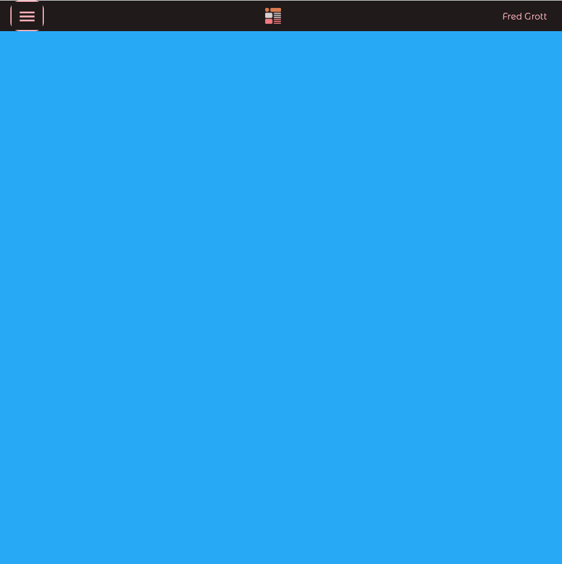
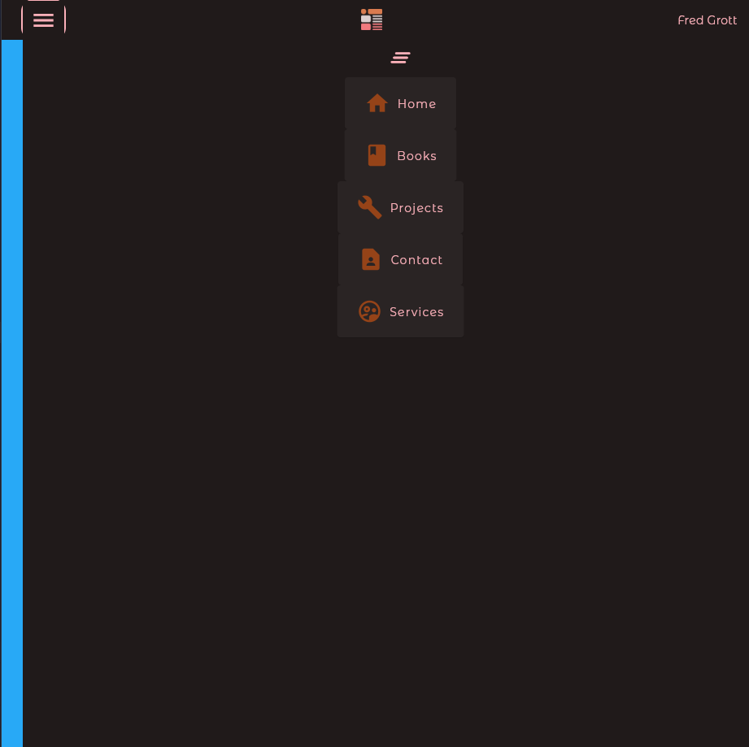

# webbar_two

A demo of how to implement a Web Bar for websites implemented in flutter. Part of my work towards the Flutter On Web development book I am writing.

## ScreenShots

Desktop

Mobile

## Medium Article

Here is the Medium Article via the friend free link:

[article](https://fredgrott.medium.com/web-drawer-animation-with-webbar-1cdbb7544fd1?sk=1f9df1d5abd68138033a8294869119c2)

Book stuff is at my GitHub IO website:

[My GitHub IO Website](https://fredgrott.github.io)

## Contact

I tend to use KeyBase as my main conferencing and contact hub, my KeyBase profile url:

[Fred Grott's KeyBase Profile](https://keybase.io/fredgrott)
